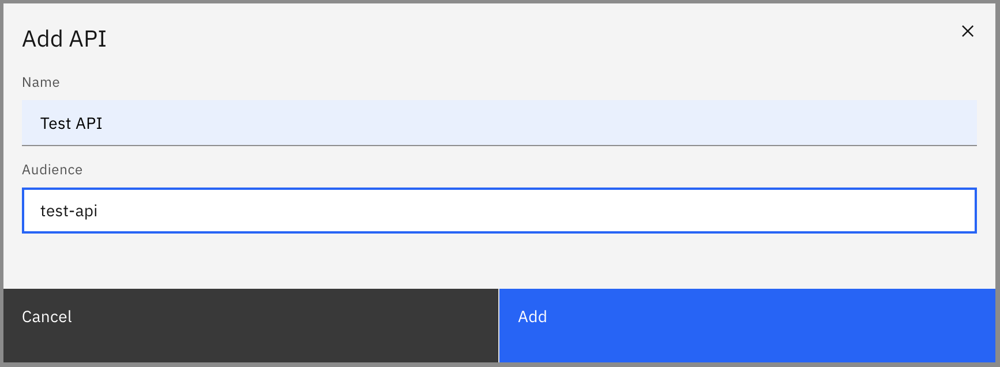
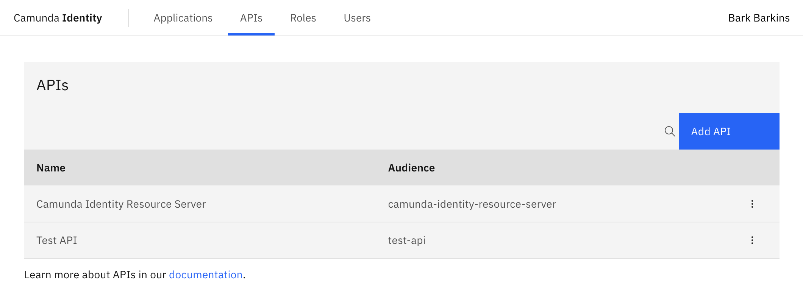

In this guide we will show you how to use Identity to create an API.

:::tip Want to learn more about APIs?
Head over to [Concepts - APIs](/self-managed/concepts/access-control/apis.md) to find out more.
:::

Firstly, log in to the Identity UI and navigate to the "API" tab:

Once here, click on the "Add API" button located on the top right of the table and a modal will open:

We are now able to fill out the details of the API, for this guide we will use a set of example values.
When you are happy with the details, click "Add":

On confirmation, the modal will close and the table will update and your new API will be shown:

You are now able to click on your new API to view the details:

